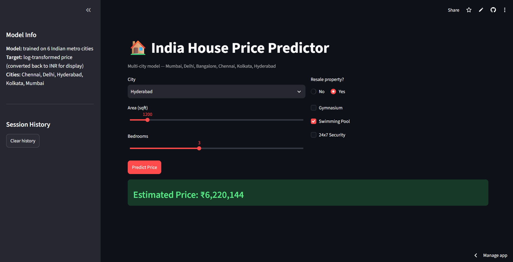
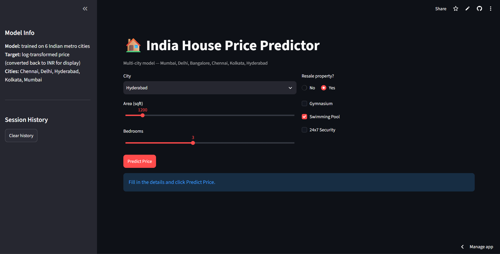

# 🏠 House Price Prediction

A machine learning web application that predicts house prices based on various features using Linear Regression. Built with Python, Scikit-learn, and Streamlit.

[](https://tayab-house-price-predictions.streamlit.app/)

## 📋 Table of Contents
- [Overview](#overview)
- [Features](#features)
- [Dataset](#dataset)
- [Installation](#installation)
- [Usage](#usage)
- [Model Details](#model-details)
- [Technologies Used](#technologies-used)
- [Project Structure](#project-structure)
- [Screenshots](#screenshots)
- [Contributing](#contributing)
- [License](#license)
- [Contact](#contact)

## 🎯 Overview

This project implements a machine learning model to predict house prices based on multiple features such as area, number of bedrooms, bathrooms, parking spaces, and other amenities. The application provides an interactive web interface where users can input property details and get instant price predictions.

**Live Demo:** [https://tayab-house-price-predictions.streamlit.app/](https://tayab-house-price-predictions.streamlit.app/)

## ✨ Features

- 🔮 **Real-time Predictions**: Get instant house price predictions based on input features
- 📊 **Interactive UI**: User-friendly interface built with Streamlit
- 📈 **Data Visualization**: Visual insights into the dataset and model performance
- 🎯 **Accurate Model**: Trained on comprehensive housing dataset
- 📱 **Responsive Design**: Works seamlessly across different devices
- 💾 **Model Persistence**: Pre-trained model saved for quick predictions

## 📊 Dataset

### Dataset Overview
The model is trained on a comprehensive house price dataset containing various features that influence property prices.

### Features Description

| Feature | Description | Type |
|---------|-------------|------|
| **area** | Total area of the house (in square feet) | Numerical |
| **bedrooms** | Number of bedrooms | Numerical |
| **bathrooms** | Number of bathrooms | Numerical |
| **stories** | Number of stories/floors | Numerical |
| **mainroad** | Whether the house is connected to main road (Yes/No) | Categorical |
| **guestroom** | Presence of a guest room (Yes/No) | Categorical |
| **basement** | Presence of a basement (Yes/No) | Categorical |
| **hotwaterheating** | Presence of hot water heating (Yes/No) | Categorical |
| **airconditioning** | Presence of air conditioning (Yes/No) | Categorical |
| **parking** | Number of parking spaces | Numerical |
| **prefarea** | Whether the house is in a preferred area (Yes/No) | Categorical |
| **furnishingstatus** | Furnishing status (Furnished/Semi-Furnished/Unfurnished) | Categorical |
| **price** | Price of the house (Target variable) | Numerical |

### Dataset Statistics
- **Total Samples**: Varies based on dataset version
- **Features**: 12 input features + 1 target variable
- **Data Type**: Mixed (Numerical and Categorical)
- **Target Variable**: House Price (Continuous)

### Data Preprocessing
- Handling missing values
- Encoding categorical variables (One-Hot Encoding/Label Encoding)
- Feature scaling and normalization
- Train-test split for model validation

## 🚀 Installation

### Prerequisites
- Python 3.7 or higher
- pip package manager

### Steps

1. **Clone the repository**
```bash
git clone https://github.com/TAYAB-HUB/House-Price-Prediction.git
cd House-Price-Prediction
```

2. **Create a virtual environment** (Optional but recommended)
```bash
python -m venv venv
source venv/bin/activate  # On Windows: venv\Scripts\activate
```

3. **Install required packages**
```bash
pip install -r requirements.txt
```

4. **Run the application**
```bash
streamlit run app.py
```

The application will open in your default web browser at `http://localhost:8501`

## 💻 Usage

1. **Access the Application**
   - Visit the [live demo](https://tayab-house-price-predictions.streamlit.app/)
   - Or run locally using the installation steps above

2. **Input Property Details**
   - Enter the area in square feet
   - Specify number of bedrooms and bathrooms
   - Select additional features (parking, basement, etc.)
   - Choose furnishing status

3. **Get Prediction**
   - Click the "Predict Price" button
   - View the estimated house price
   - Explore data visualizations and insights

## 🔬 Model Details

### Algorithm
- **Model Type**: Linear Regression
- **Library**: Scikit-learn

### Model Performance
The model is evaluated using the following metrics:
- **R² Score**: Coefficient of determination
- **Mean Absolute Error (MAE)**
- **Root Mean Squared Error (RMSE)**

### Training Process
1. Data collection and preprocessing
2. Feature engineering and selection
3. Train-test split (typically 80-20)
4. Model training using Linear Regression
5. Model evaluation and validation
6. Model serialization for deployment

## 🛠️ Technologies Used

- **Python 3.x** - Programming language
- **Streamlit** - Web application framework
- **Scikit-learn** - Machine learning library
- **Pandas** - Data manipulation and analysis
- **NumPy** - Numerical computing
- **Matplotlib/Seaborn** - Data visualization
- **Pickle** - Model serialization

## 📁 Project Structure

```
House-Price-Prediction/
│
├── app.py                      # Main Streamlit application
├── model.pkl                   # Trained model (serialized)
├── requirements.txt            # Project dependencies
├── README.md                   # Project documentation
│
├── data/
│   └── housing_data.csv       # Dataset (if included)
│
├── notebooks/
│   └── model_training.ipynb   # Jupyter notebook for training
│
└── src/
    ├── preprocessing.py       # Data preprocessing functions
    ├── model.py              # Model training and evaluation
    └── utils.py              # Utility functions
```

## 📸 Screenshots

### Home Page


### Prediction Interface


### Data Visualization


## 🤝 Contributing

Contributions are welcome! Here's how you can help:

1. **Fork the repository**
2. **Create a feature branch**
   ```bash
   git checkout -b feature/AmazingFeature
   ```
3. **Commit your changes**
   ```bash
   git commit -m 'Add some AmazingFeature'
   ```
4. **Push to the branch**
   ```bash
   git push origin feature/AmazingFeature
   ```
5. **Open a Pull Request**

### Areas for Contribution
- Improve model accuracy
- Add more features
- Enhance UI/UX
- Add more visualization options
- Implement other ML algorithms
- Improve documentation

## 📝 License

This project is licensed under the MIT License - see the [LICENSE](LICENSE) file for details.

## 👤 Contact

**TAYAB**

- GitHub: [@TAYAB-HUB](https://github.com/TAYAB-HUB)
- Project Link: [https://github.com/TAYAB-HUB/House-Price-Prediction](https://github.com/TAYAB-HUB/House-Price-Prediction)
- Live Demo: [https://tayab-house-price-predictions.streamlit.app/](https://tayab-house-price-predictions.streamlit.app/)

## 🙏 Acknowledgments

- Dataset source: [Mention the source if applicable]
- Streamlit for the amazing framework
- Scikit-learn for machine learning tools
- All contributors and supporters

---

⭐ **If you found this project helpful, please give it a star!** ⭐

---

## 📈 Future Enhancements

- [ ] Implement multiple ML algorithms (Random Forest, XGBoost, etc.)
- [ ] Add model comparison feature
- [ ] Include more house features
- [ ] Add location-based pricing
- [ ] Implement user authentication
- [ ] Add historical price trends
- [ ] Deploy on multiple platforms
- [ ] Add API endpoints
- [ ] Include data upload feature
- [ ] Add model retraining capability

---

**Made with ❤️ by TAYAB**